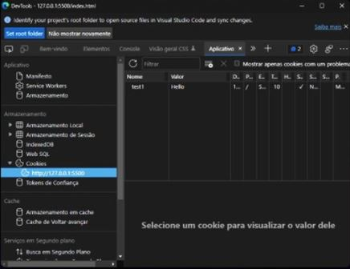
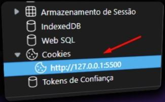

 O que é um COOKIE?

    Um Cookie é um fragmento de dados armazenados pelo navegador no computador do usuário. Os Cookies se assemelham as variáveis, porém um cookie permanece intacto após o fechamento do navegador, refresh da página, desligamento do computador e etc.

Como testar cookies no localhost?

    Para testar cookies no ambiente local eu recomendo o uso da extensão live server no vs code, pois quando clicamos para abrir o HTML com live server a extensão cria um servidor HTTP que tem o papel de servir páginas HTML. Dessa forma, com este servidor HTTP de pé temos uma url que permite que o cookie seja criado e anexado a essa url;

https://www.instagram.com/p/CZPHJHgOtuz/
